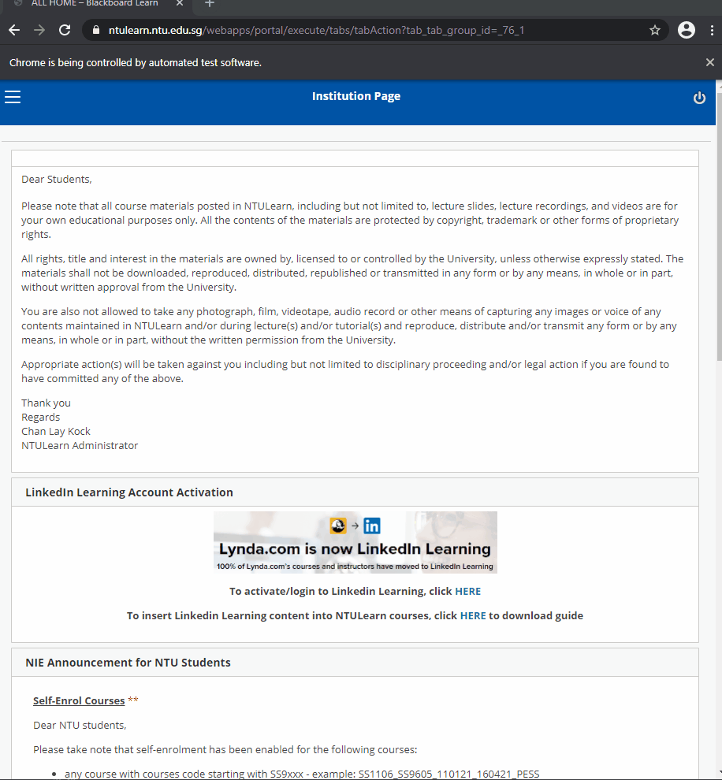
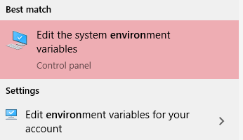
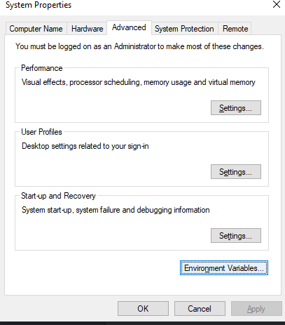
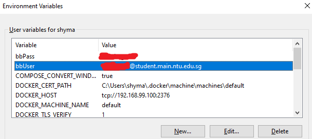

# Blackboard Scraper

### Description

Do you ever feel that the accumulated time spent downloading each file from Blackboard can be more productively spent?

Well, scrape these files programmatically instead!

*Peek at interface of Selenium:*


## Table of content
1. Features
2. How to use
3. Explanation


## 1. Features
- Replicate folder structure of a site
- Download all files and items and place in appropriate folders
- Complete process from login to end

## 2. How to use

### 2.1. Clone repository

Firstly, **clone** this repository locally into your machine.

### 2.2. Dependencies

Secondly, ensure that you have the **required dependencies** of selenium and bs4. It can easily be obtained through `pip install -r requirements.txt` or

```
pip install selenium
pip install beautifulsoup4
```
### 2.3. Environment variables

It is often not good practice to leave credentials in any script. This can be circumvented through using **environment variables**.
- For Windows, Go to Start -> Edit the system environment variables



- Advanced -> Environment Variables...



- Under user variables, create variables **bbUser** and **bbPass** for username and password for Blackboard respectively. Alternatively, you can rename variable names under *mySelenium.py* and customize your user environment variables.



### 2.4. Script variables

There might be a few **variables** I believe that differ from schools to schools, despite using the same Blackboard platform. Do edit the variables inside *variables.py* accordingly:
1. `url`

Page where you key your username and password to login to Blackboard.

2. `mainSite`

This would be the url of the home page after you have logged in.

3. `chromedriver`

The location of the file *chromedriver.exe*. The file is included in this repository, but do Google for the latest update of it if you wish.

4. `downloadSleepTime`

Selenium has no built-in function to understand whether a file has completed download or not. Hence, the script downloads files or attachments and immediately moves it after the sleep timer interval, where a short sleep time will suffice for small files. However, do consider increasing the sleep timer if the script fails or you anticipate there are large files.

5. `startFolder` & `startLink`

You can name startFolder as anything you want, but ideally the module's name. This has to be in the same seqeunce as  startLink. For instance, if I have 3 pages of startFolder ['Leadership - Content', 'Leadership - Reference', 'Entrepreneurship'], startLink would be a list of the 3 respective links in sequence.

### 2.5 Run

Finally, just execute *run.py*. Files like *bs4Test.py* is optional.

## 3. Note

I am not responsible for anyone's usage or abuse of this method.

Please use this and any other scraping methods responsibly.
